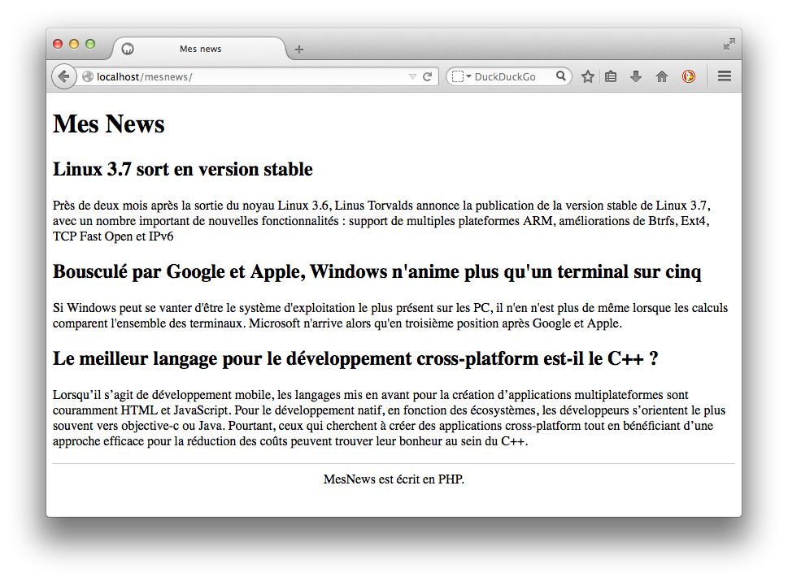
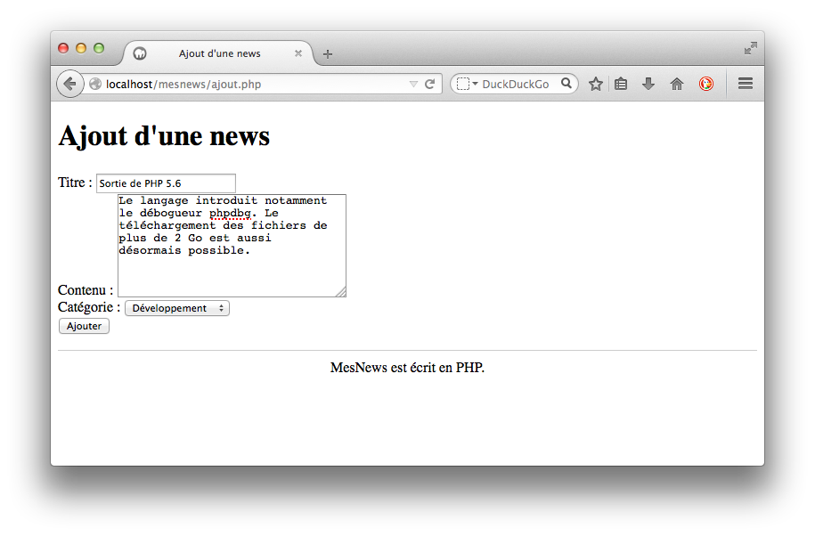
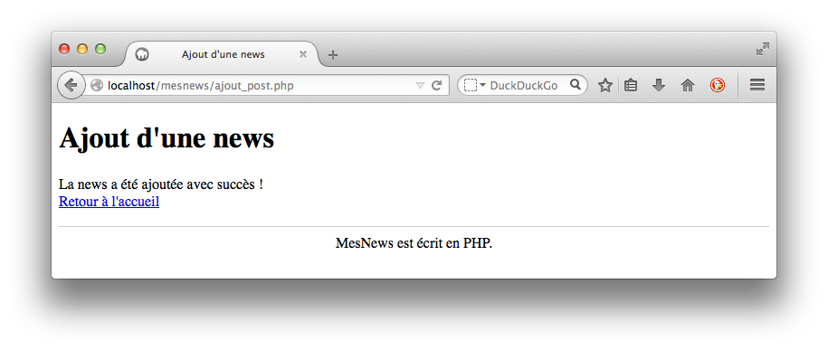

## Contexte

On vous fournit le script SQL suivant qui définit une liste de news.

~~~
drop table if exists T_NEWS;
drop table if exists T_CATEGORIE;

create table T_CATEGORIE (
    CAT_ID integer primary key auto_increment,
    CAT_NOM varchar(100) not null
) ENGINE=INNODB CHARACTER SET utf8 COLLATE utf8_unicode_ci;

create table T_NEWS (
    NEWS_ID integer primary key auto_increment,
    NEWS_TITRE varchar(100) not null,
    NEWS_CONTENU varchar(500) not null,
    CAT_ID integer not null,
    constraint fk_news_cat foreign key(CAT_ID) references T_CATEGORIE(CAT_ID)
) ENGINE=INNODB CHARACTER SET utf8 COLLATE utf8_unicode_ci;
    
insert into T_CATEGORIE(CAT_NOM) values ('Développement');
insert into T_CATEGORIE(CAT_NOM) values ('Système');
insert into T_CATEGORIE(CAT_NOM) values ('Internet');

insert into T_NEWS(NEWS_TITRE, NEWS_CONTENU, CAT_ID) values
("Le meilleur langage pour le développement cross-platform est-il le C++ ?",
"Lorsqu'il s'agit de développement mobile, les langages mis en avant pour la création d'applications multiplateformes sont couramment HTML et JavaScript. Pour le développement natif, en fonction des écosystèmes, les développeurs s'orientent le plus souvent vers objective-c ou Java. Pourtant, ceux qui cherchent à créer des applications cross-platform tout en bénéficiant d'une approche efficace pour la réduction des coûts peuvent trouver leur bonheur au sein du C++.", 1);

insert into T_NEWS(NEWS_TITRE, NEWS_CONTENU, CAT_ID) values
("Bousculé par Google et Apple, Windows n'anime plus qu'un terminal sur cinq",
"Si Windows  peut se vanter d'être le système d'exploitation le plus présent sur les PC, il n'en n'est plus de même lorsque les calculs comparent l'ensemble des terminaux. Microsoft n'arrive alors qu'en troisième position après Google et Apple.", 2);

insert into T_NEWS(NEWS_TITRE, NEWS_CONTENU, CAT_ID) values
("Linux 3.7 sort en version stable", 
"Près de deux mois après la sortie du noyau Linux 3.6, Linus Torvalds annonce la publication de la version stable de Linux 3.7, avec un nombre important de nouvelles fonctionnalités : support de multiples plateformes ARM, améliorations de Btrfs, Ext4, TCP Fast Open et IPv6", 2); 
~~~

# Travail à réaliser

## Partie 1

* Créez sous MySQL une base de données `mesnews` puis implantez-y le schéma relationnel et les données d'exemple.

* Créez l'utilisateur MySQL `mesnews_user` avec le mot de passe `secret` et tous les droits sur la base `mesnews`.

* Dans un dossier `MesNews` à créer sur votre serveur Web, écrivez la page PHP `index.php` qui récupère et affiche la liste des news issue de la base de données. Voici les contraintes techniques associées :

    * La technologie de connexion à la BD doit être PDO.
    * L'utilisateur MySQL employé pour se connecter à la BD depuis `index.php` doit être `mesnews_user` et non pas `root`.
    * Les balises HTML5 `<header>`, `<article>` et `<footer>` doivent être utilisées.

* Créez la feuille de style `mesnews.css` afin de parvenir au résultat ci-dessous.

{:.centered}

## Partie 2

* Ajoutez dans la page `index.php` (entre le titre et les articles) un lien vers `ajout.php`.

* Dans votre dossier `MesNews`, écrivez la page PHP `ajout.php` qui affiche un formulaire permettant à l'utilisateur de saisir les propriétés d'une news. Voici les contraintes techniques associées :

    * Le formulaire renvoie vers la page `ajout_post.php`. 
    * Sa mise en forme est secondaire.
    * Les champs **Titre** et **Contenu** sont obligatoires.
    * La liste des catégories provient de la base de données.

{:.centered}

* Dans votre dossier `MesNews`, écrivez la page PHP `ajout_post.php` qui utilise les données reçues du formulaire afin d'ajouter une news dans la base de données. Elle affiche un message en fin d'opération, ainsi qu'un lien vers la page `index.php`.

{:.centered}

