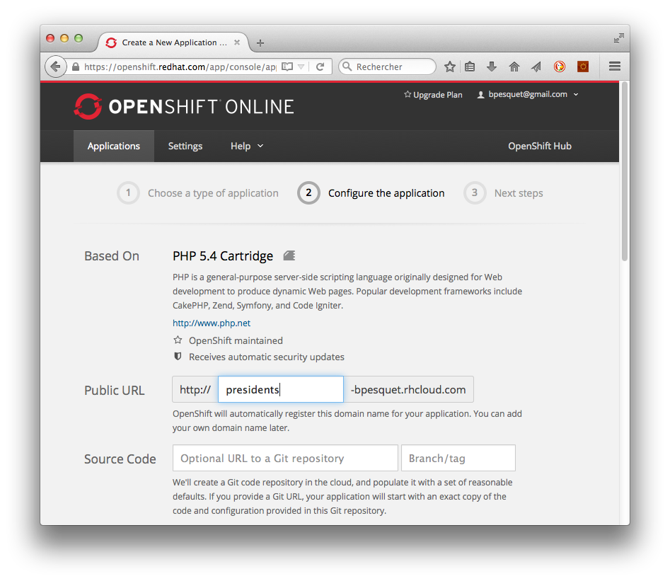
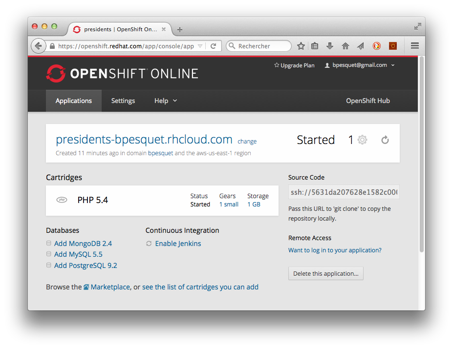
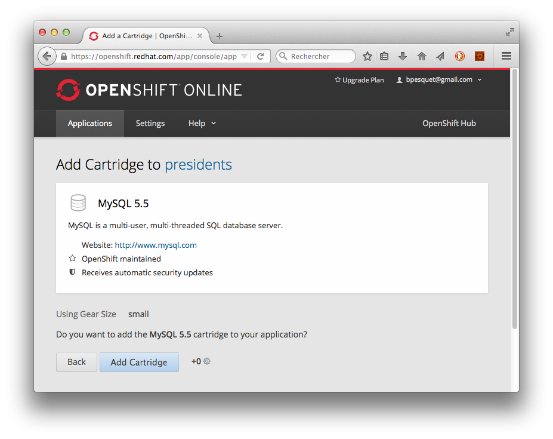
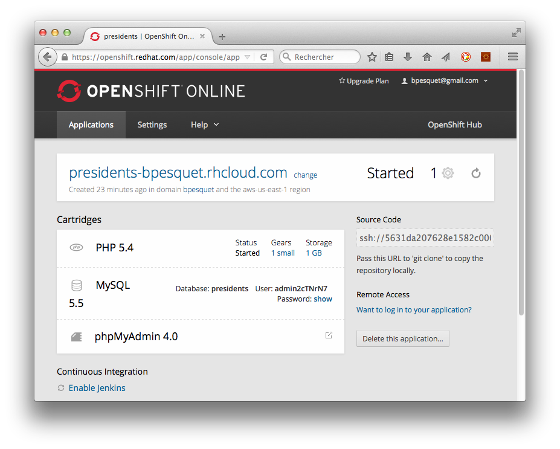
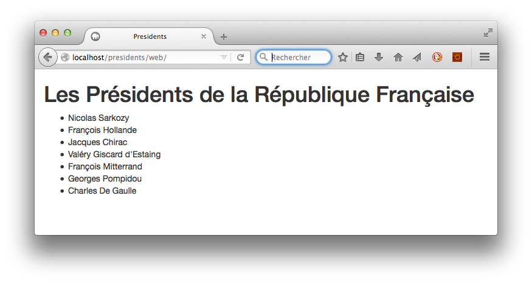
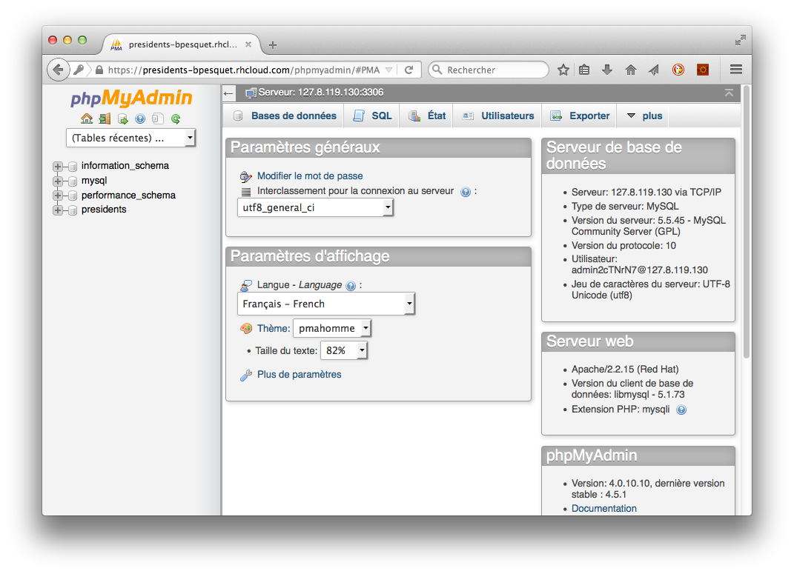
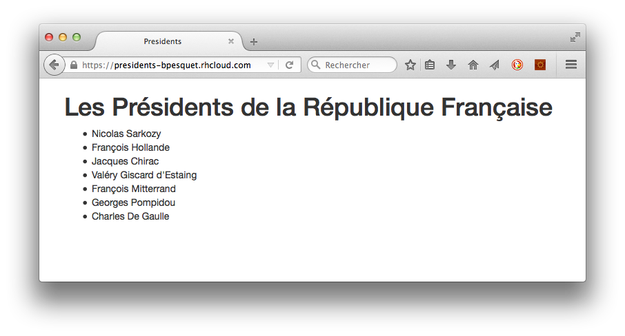
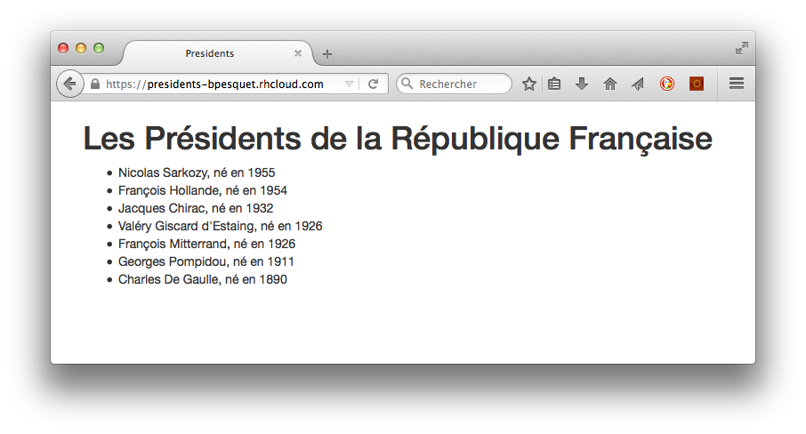

[OpenShift](https://www.openshift.com) est une plate-forme de publication d'applications de type [PaaS](https://fr.wikipedia.org/wiki/Plate-forme_en_tant_que_service) concue par la société [RedHat](http://www.redhat.com/). 

{:.centered}

Elle permet de déployer grauitement jusqu'à trois applications et supporte de nombreux langages : Java, Ruby, Python, PHP, Node.js, etc. 

Nous allons l'utiliser pour déployer une application PHP utilisant le framework Silex ainsi que MySQL.

## Création d'une nouvelle application sur OpenShift

* Créez votre compte sur [OpenShift](https://www.openshift.com/app/account).

* Installez sur votre machine locale les [outils client OpenShift](https://developers.openshift.com/en/managing-client-tools.html), appelés **rhc**.

    * Si vous êtes sous Windows, suivez pas-à-pas la [documentation OpenShift](https://developers.openshift.com/en/getting-started-windows.html) pour vous guider.

    * Choisissez la version 2.1.7 de Ruby.

    * Après l'installation de Ruby, éditez le fichier `C:\Ruby21-x64\lib\ruby\2.1.0\win32\registry.rb` et modifiez la ligne 70 comme indiqué ci-dessous.

~~~
#LOCALE = Encoding.find(Encoding.locale_charmap)
LOCALE = Encoding::UTF_8
~~~

* Une fois les outils **rhc** installés, ouvrez un terminal puis tapez la commande suivante pour lancer leur configuration (le `$` représente l'invite de commande et ne doit pas être tapé).

~~~
$ rhc setup
~~~    

* Laissez le nom de serveur par défaut, puis continuez la procédure en saisissant votre login/mot de passe OpenShift et en répondant `yes` aux questions posées. Choisissez un nom unique comme *namespace* (exemple : **bpesquet**). Les outils OpenShift sont maintenant installés sur votre machine.

* Connectez-vous sur [OpenShift](https://openshift.redhat.com/app/login) puis choisissez de créer une nouvelle application. Sélectionnez PHP 5.4 puis saisissez `presidents` dans l'URL publique de la nouvelle application. 

{:.centered}

* Gardez tous les autres choix par défaut puis cliquez sur le bouton **Create Application**. Au bout de quelques dizaines de secondes, l'application OpenShift est créée. Cliquez sur *Continue to the application overview page* pour arriver sur le tableau de bord de la nouvelle application.

{:.centered}

* Ajoutez MySQL 5.5 à votre application en cliquant sur le lien associé.

{:.centered}

* Cliquez sur le bouton **Add Cartridge**. Au bout de quelques dizaines de secondes, une base de données MySQL est ajoutée à votre application. Un utilisateur dédié permet de s'y connecter. 

* Cliquez sur le lien *Add phpMyAdmin 4.0* pour ajouter l'outil d'administration phpMyAdmin.

{:.centered}

* Cliquez sur le bouton **Add Cartridge**. Au bout de quelques dizaines de secondes, phpMyAdmin est ajouté à votre application.

{:.centered}

## Lien avec un projet existant

* Récupérez puis installez localement votre version du projet [presidents](https://github.com/lmdsio-slam5/presidents) (les consignes d'installation sont dans le `README`). N'allez pas plus loin avant que l'URL http://presidents ne fonctionne sur votre machine.

{:.centered}

Une application OpenShift correspond à un dépôt Git hébergé chez OpenShift. Pour pouvoir déployer une application existante, il faut lier son dépôt Git local au dépôt distant OpenShift.

* Allez sur votre [tableau de bord OpenShift](https://openshift.redhat.com/app/console/applications), cliquez sur votre application `presidents` puis copiez l'URL de son dépôt (elle est de type `ssh://...`). 

* Dans un terminal, déplacez-vous dans le répertoire du projet `presidents`. Tapez successivement les commandes suivantes.

~~~
$ git remote add openshift <url_depot_openshift_copiee>
$ git fetch openshift
$ git merge openshift/master -s recursive -X ours
~~~

* Si vous êtes sous Windows, tapez ensuite :

~~~
$ echo "" > .openshift/markers/use_composer
~~~

* Si vous êtes sous Mac OS/Linux, tapez ensuite :    

~~~
$ touch .openshift/markers/use_composer
~~~

Le répertoire `.openshift` contient maintenant tous les paramètres liés à OpenShift.

* Donnez au fichier `app/config/dev.php` de votre projet `presidents` le contenu ci-dessous. Il correspond au déploiement sur le serveur Apache/MySQL local.

~~~
<?php

// Doctrine (db)
$app['db.options'] = array(
    'driver'   => 'pdo_mysql',
    'charset'  => 'utf8',
    'host'     => '127.0.0.1',
    'port'     => '3306',
    'dbname'   => 'presidents',
    'user'     => 'presidents_user',
    'password' => 'secret',
);

// enable the debug mode
$app['debug'] = true;
~~~

* Vérifiez que l'URL http://presidents fonctionne toujours.

A présent, nous allons utiliser le fichier `app/config/prod.php` pour définir la configuration liée au déploiement sur OpenShift. Les paramètres d'accès à la base de données seront spécifiques.

* Donnez au fichier `app/config/prod.php` le contenu ci-dessous.

~~~
<?php

// MySQL config for OpenShift
$dbHost = getenv('OPENSHIFT_MYSQL_DB_HOST');
$dbPort = getenv('OPENSHIFT_MYSQL_DB_PORT');
$dbName = getenv('OPENSHIFT_GEAR_NAME');
$dbUser = getenv('OPENSHIFT_MYSQL_DB_USERNAME');
$dbPassword = getenv('OPENSHIFT_MYSQL_DB_PASSWORD');

// Doctrine (db)
$app['db.options'] = array(
    'driver'   => 'pdo_mysql',
    'charset'  => 'utf8',
    'host'     => "$dbHost",
    'port'     => "$dbPort",
    'dbname'   => "$dbName",
    'user'     => "$dbUser",
    'password' => "$dbPassword",
);
~~~

* Modifiez le fichier `web/index.php` pour utiliser la configuration OpenShift.

~~~
// require __DIR__.'/../app/config/dev.php';
require __DIR__.'/../app/config/prod.php';
~~~

* Committez vos modifications dans le dépôt Git local.

~~~
$ git add --all
$ git commit -m "Add OpenShift"
~~~

* Enfin, tapez la commande suivante.

~~~
$ git push openshift master
~~~

Et là, c'est magique : le dépôt local est poussé sur OpenShift, ce qui déclenche automatiquement l'installation des composants et le déploiement en ligne. Pas de connexion FTP, pas d'hôte virtuel ou de redirection à configurer sur le serveur distant, rien.

{:.centered}

Il ne reste plus qu'à implanter le schéma de la base de données sur OpenShift.

* Allez sur votre [tableau de bord OpenShift](https://openshift.redhat.com/app/console/applications), cliquez sur votre application `presidents` puis notez le login et le mot de passe de votre base de données.

* Dans un autre onglet, ouvrez l'URL https://presidents-VotreCompteOpenShift.rhcloud.com/phpmyadmin/. Saisissez le login/mot de passe demandés. Vous accédez à l'accueil de phpMyAdmin.

{:.centered}

* La base `presidents` a déjà été créée. Importez les scripts `structure.sql` et `content.sql` pour créer le schéma BD et les données de test.

* A présent, accédez à l'URL https://presidents-VotreCompteOpenShift.rhcloud.com. L'application fonctionne sur OpenShift !

{:.centered}

## Modifications ultérieures

Une fois la configuration initiale effectuée, le déploiement de nouvelles modifications se fait en les committant dans le dépôt local, puis en lançant la commande :

~~~
$ git push openshift master
~~~

Il faudra jongler entre les configurations `dev` et `prod` dans le fichier `web/index.php` pour pouvoir tester localement puis déployer sur OpenShift.

## Exercice

* Modifiez l'application pour qu'elle affiche les dates de naissance des Présidents, puis déployez vos modifications sur OpenShift.

{:.centered}
