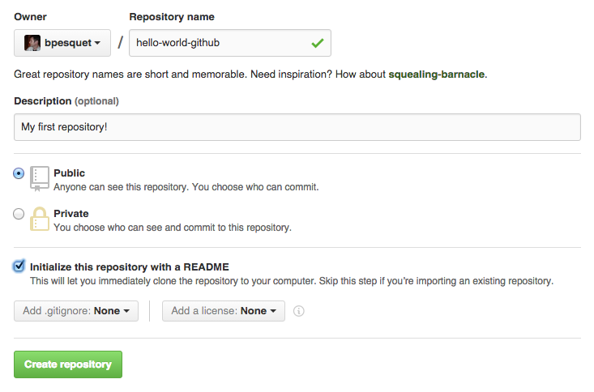
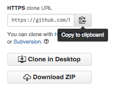
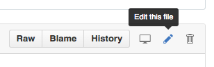
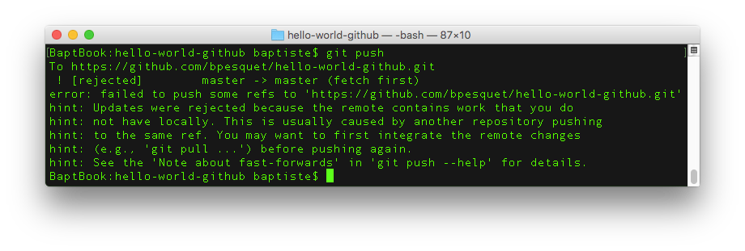
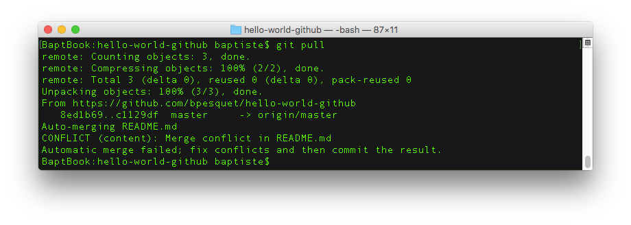

## Pré-requis

Pour réaliser cette activité, vous devez :

* Connaître les bases du fonctionnement de Git.
* Avoir installé Git sur votre machine. Si ce n'est pas le cas, vous devez le [télécharger](https://git-scm.com/downloads) puis l'installer.
    * Si vous êtes sous Windows, pensez à choisir l'option "Use from Windows command prompt" pendant l'installation pour pouvoir utiliser Git depuis un terminal standard.
* Posséder un compte GitHub (c'est gratuit). 

## Etapes

* (Optionnel) Lancez l'installation de [GitHub Desktop](https://desktop.github.com/) pour votre environnement.

* Sans attendre la fin de l'installation, connectez-vous sur [github.com](https://github.com/) et créez un nouveau dépôt (*repository*) nommé `hello-world-github` avec les paramètres ci-dessous.

{:.centered}

* Copiez l'URL du dépôt GitHub (zone en bas à droite).

{:.centered}

* Sur votre poste de travail, ouvrez un terminal puis déplacez-vous dans votre répertoire de travail.

* Depuis le terminal, lancez la commande `git config --global user.email <votre courriel GitHub>`.

* Vérifiez le résultat en lançant la commande `git config --global user.email`. Elle doit maintenant afficher le courriel de votre compte GitHub.

* Depuis le terminal, clonez le dépôt avec la commande : `git clone <URL copiée>`. Un répertoire `hello-world-github` contenant le dépôt est créé.

* Dans ce répertoire, ouvrez le fichier README.md avec votre éditeur de texte favori et donnez-lui le contenu suivant  :

~~~
# hello-world-github

Ceci est mon premier dépôt GitHub.
~~~

* Depuis le terminal, déplacez-vous dans ce répertoire `hello-world-github` puis committez votre modification (`git add` puis `git commit`) dans votre dépôt local avec le commentaire `Modification README`.

* Lancez la commande `git push`. Votre modification est *poussée* sur votre dépôt GitHub.

* Depuis github.com, cliquez sur le fichier README.md puis cliquez sur le bouton d'édition.

{:.centered}

* Ajoutez au fichier le contenu suivant :

~~~
Mais pas le dernier !
~~~

* Committez votre modification avec le commentaire `Ajout d'une ligne`.

* Depuis le terminal, lancez la commande `git pull` pour récupérer la modification depuis GitHub.

* Lancez la commande `git log` pour afficher l'historique des modfications.

* Depuis github.com, modifiez le fichier `README.md` de la manière suivante.

~~~
# hello-world-github BIS
~~~

* Commitez vos modifications avec le commentaire "Modification titre GitHub".

* Avant d'effectuer un `git pull`, modifiez le fichier `README.md` sur votre machine locale de la manière suivante.

~~~
# hello-world-github TER
~~~

* Commitez vos modifications dans votre dépôt local avec le commentaire "Modification titre locale".

* Tentez de pusher votre modification locale vers GitHub. Vous obtenez un message d'erreur : vous devez d'abord intégrer les modifications faites sur le dépôt GitHub.

{:.centered}

* Effectuez un `git pull` pour récupérer localement les modifications du dépôt GitHub : un **conflit** est apparu sur le fichier `README.md`, qui a été modifié des deux côtés et qui ne peut pas être fusionné automatiquement par Git. Une intervention manuelle est nécessaire.

{:.centered}

* Ouvrez le fichier `README.md` avec un éditeur de texte. Les zones en conflit sont délimitées par des marqueurs `<<<<<<<` et `>>>>>>>`. La zone `HEAD` correspond à la modification faite localement. L'autre zone correspond à la modification réalisée sur github.com.

~~~
<<<<<<< HEAD
# hello-world-github TER
=======
# hello-world-github BIS
>>>>>>> c1129dfbbe585fc94978be38625b5ae7f63474bf
~~~

* Résolvez le conflit en modifiant le titre et en supprimant les marques de conflit dans le fichier.

~~~
# hello-world-github FINAL
~~~

* Faites un `git add` pour indiquer la résolution puis commitez le fichier fusionné avec le commentaire "Résolution conflit".

* Pushez les modifications sur GitHub pour voir apparaître le nouveau titre.

* (Optionnel) Lorsque l'installation de GitHub Desktop est terminée, lancez-le puis choisissez d'ajouter un nouvel dépôt (*Add repository*). Sélectionnez le répertoire `hello-world-github` puis validez.

* (Optionnel) Observez l'historique des modifications sur le dépôt avec GitHub Desktop.
 
* (Optionnel) Ajoutez localement une nouvelle ligne de votre choix au fichier README.md.

* (Optionnel) Depuis GitHub Desktop, committez votre modification avec un commentaire puis cliquez sur le bouton **Sync** en haut à droite. La nouvelle modification est poussée sur GitHub. 

