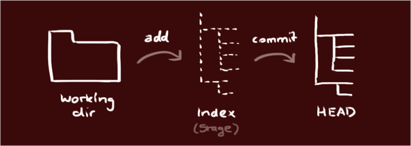

## Processus de travail

{:.centered}

## Commandes de bases

|Commande | Action |
-----------|---------
| `git init` | Crée un nouveau dépôt Git. |
| `git status`| Affiche l'état du répertoire de travail par rapport au dépôt. |
| `git add filename`| Ajoute le fichier *filename* du répertoire de travail dans l'Index. `git add --all` ajoute tous les fichiers nouveaux ou modifiés.
| `git commit -m message`| Stocke les changements de l'Index dans le dépôt avec *message* comme commentaire de commit.
| `git diff filename`| Affiche les différences par rapport à l'Index pour le fichier *filename* du répertoire de travail.
| `git log`| Affiche la liste des derniers commits.

## Annulations

|Commande | Action |
-----------|---------
| `git checkout HEAD filename` | Remplace la version locale de *filename* par la dernière version committée.
|`git reset HEAD filename`| Enlève le fichier *filename* de l'Index.
|`git reset commit-SHA`| Revient à un précédent commit identifié par *commit-SHA* (ses 7 premiers caractères).

## Branches

|Commande | Action |
-----------|---------
|`git branch`|Liste toutes les branches du dépôt.
|`git branch branch-name`| Crée une nouvelle branche nommée *branch-name*.
|`git checkout branch-name`| Définit *branch-name* comme la branche courante.
|`git merge branch-name`| Intègre le contenu de *branch-name* dans la branche courante.
|`git branch -d branch-name`| Supprime la branche *branch-name*.

## Collaboration

|Commande | Action |
-----------|---------
|`git clone remote-location`| Crée une copie locale du dépôt distant situé à l'emplacement *remote-location*. Le dépôt distant est nommé `origin`.
|`git remote -v`| Affiche la liste des dépôts distants liés au dépôt local.
|`git remote add remote-name remote-location`| Ajoute le dépôt distant situé à l'emplacement *remote-location* sous le nom *remote-name*.
|`git fetch remote-name`| Récupère le contenu du dépôt distant *remote-name* dans la branche *remote-name/master*, qu'on appelle une branche distante.
|`git merge remote-name/master`| Intègre le contenu de la branche distante *remote-name/master* dans la branche courante.
|`git push remote-name branch-name`| Pousse le contenu de la branche locale *branch-name* vers le dépôt distant *remote-name*.
